# 📄 AI-Powered Resume Relevance System  
_Revolutionizing Hiring with Intelligence_

[](https://www.python.org/) 
[](https://fastapi.tiangolo.com/) 
[](https://streamlit.io/) 
[](https://www.sqlite.org/)  
[](LICENSE) 
[](CONTRIBUTING.md)  

---

> ⚡ An **intelligent resume analysis system** that helps **job seekers** improve their resumes instantly and enables **recruiters** to find the best talent faster — powered by **AI-driven scoring & Google Gemini insights**.

---

## ✨ Features at a Glance  

### 👩‍💼 For Job Seekers
- 🔑 **Secure Authentication** – Simple login & signup.  
- 🔍 **Job Discovery** – Browse a clean list of open positions.  
- 📄 **Effortless Apply** – Upload PDF or DOCX resumes.  
- 📊 **Comprehensive Analysis** – Instant breakdown with:  
  - ✅ **Relevance Score (0–100%)**  
  - 🟢 **Verdict**: High / Medium / Low  
  - 🧩 **Skill Breakdown**: Hard skills & semantic fit  
  - 🤖 **AI Feedback**: Personalized tips from Gemini  


---

### 🏢 For Recruiters
- 🔐 **Role-Based Access** – Admin dashboard for secure management.  
- 📝 **Job Management** – Define must-have & good-to-have skills.  
- 📋 **Centralized Dashboard** – All applications in one place.  
- 🎯 **Smart Filters** – Filter by relevance score & location.  
- 🧾 **Detailed Candidate Review** – AI summaries + skill breakdown.  


---

## ⚙️ How It Works  

1️⃣ **Hard Skill Matching (60%)**  
Matches extracted resume skills against `must-have` & `good-to-have`.  

2️⃣ **Semantic Relevance (40%)**  
Uses **sentence-transformers** + **cosine similarity** to check conceptual alignment beyond keywords.  

3️⃣ **AI Insights (Gemini)**  
- 🧑‍💻 Candidate: acts like a resume coach.  
- 🕵️ Recruiter: quick-fit summaries for faster hiring.  

---

## 💻 Tech Stack  

| Layer            | Technology                                                                 |
|------------------|-----------------------------------------------------------------------------|
| **Backend**      | [FastAPI](https://fastapi.tiangolo.com/), SQLAlchemy, Google Gemini API     |
| **Frontend**     | [Streamlit](https://streamlit.io/), Plotly, Pandas                          |
| **Parsing**      | PyMuPDF (PDF), python-docx2txt (DOCX)                                       |
| **AI & NLP**     | Sentence-Transformers, Rapidfuzz                                            |
| **Database**     | [SQLite](https://www.sqlite.org/) (default, can swap with PostgreSQL/MySQL) |

---

## 🚀 Getting Started  

### ✅ Prerequisites  
- Python 3.8+  
- `pip` package manager  

### 1️⃣ Clone the Repository  

```bash
git clone <your-repo-url>
cd <your-repo-directory>
```

### 2️⃣ Install Dependencies  

```bash
pip install -r requirements.txt
```

<details>
<summary>📦 requirements.txt</summary>

```
fastapi
uvicorn[standard]
sqlalchemy
streamlit
requests
pandas
plotly
python-dotenv
google-generativeai
pymupdf
docx2txt
rapidfuzz
sentence-transformers
```
</details>

### 3️⃣ Configure Environment  

```env
GEMINI_API_KEY="YOUR_GEMINI_API_KEY_HERE"
```

### 4️⃣ Run the App  

**Backend (FastAPI):**  
```bash
uvicorn backend.app:app --reload
```
👉 Runs at: `http://127.0.0.1:8000`

**Frontend (Streamlit):**  
```bash
streamlit run frontend/dashboard.py
```
👉 Opens at: `http://localhost:8501`

---

## 📖 Usage Walkthrough  

1. 👨‍💼 **Admin** creates job description.  
2. 🙋 **Candidate** applies by uploading resume.  
3. 📊 Instant AI-powered feedback is shown.  
4. 🏢 **Recruiter** reviews and filters submissions.  

---

## 🔮 Roadmap  

- 📂 **Batch Resume Upload** for recruiters  
- 🧠 **Advanced NLP (NER)** to extract experience & education  
- 🔌 **ATS Integration** for seamless HR workflows  
- 🐳 **Dockerization** for easy deployment  
- 📈 **Historical Tracking** of candidate resume scores  

---
# Screenshots

## 📸 Screenshots  

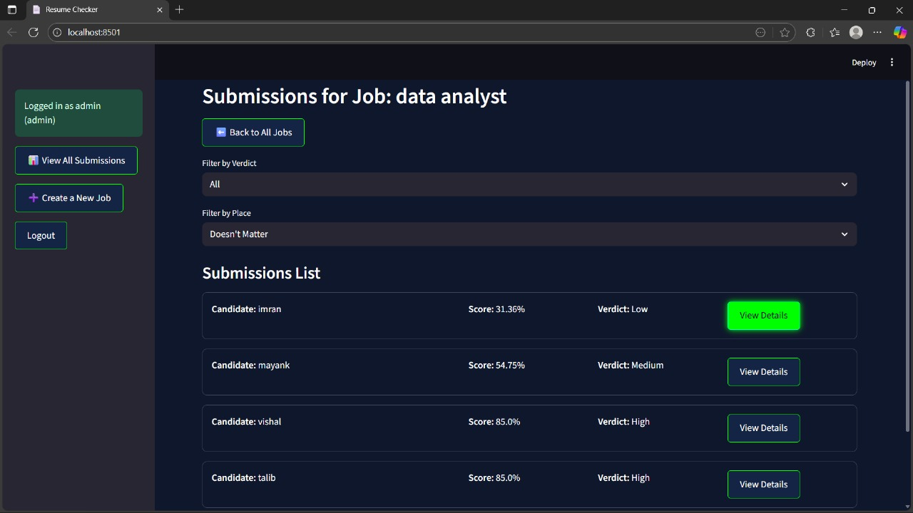  
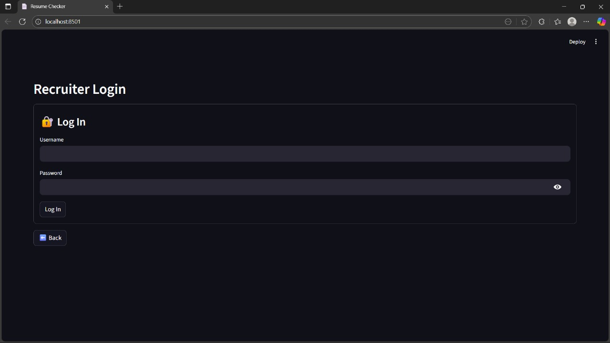  
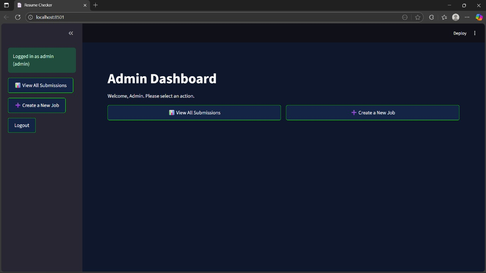  
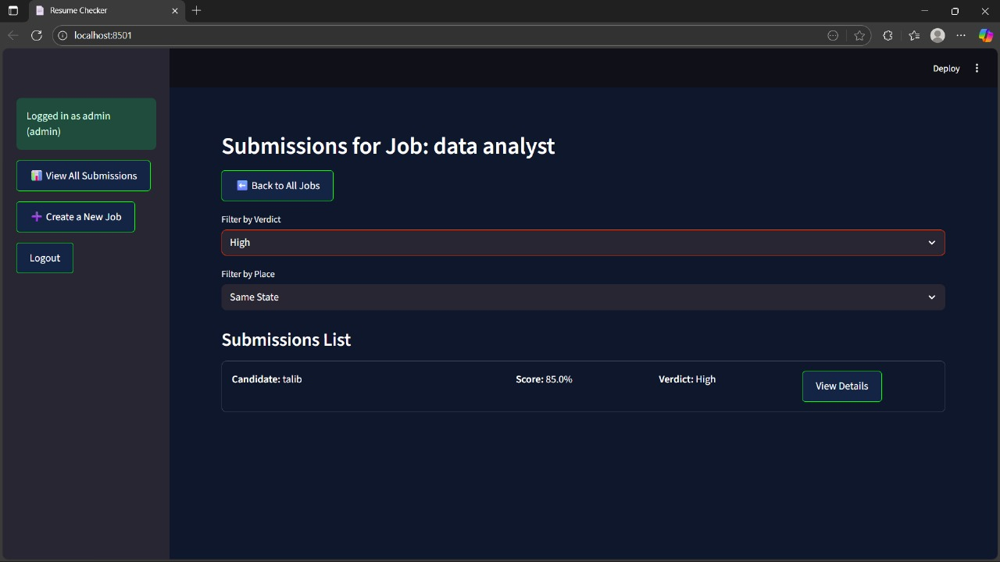  
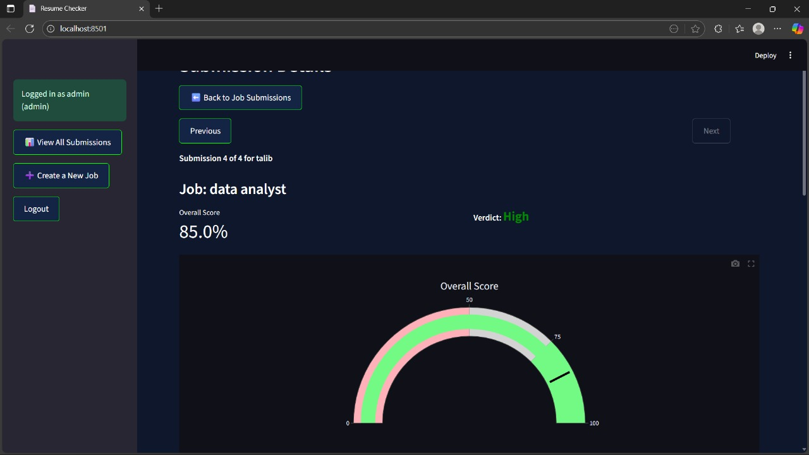  
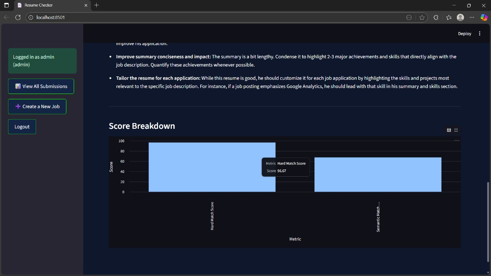  
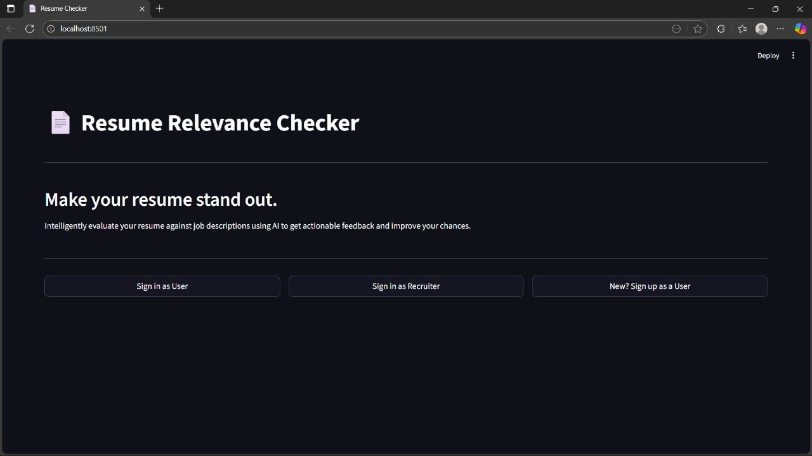  
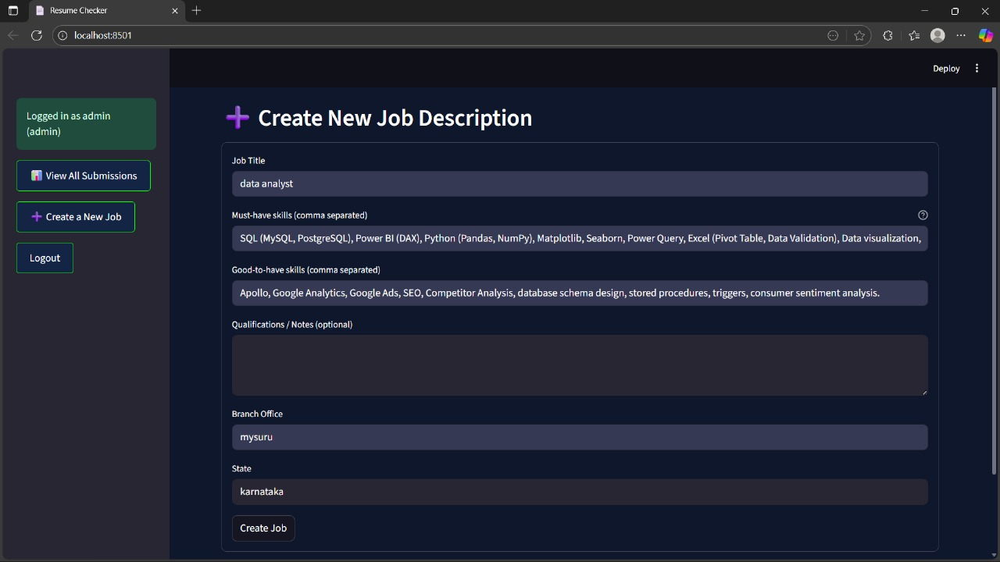  
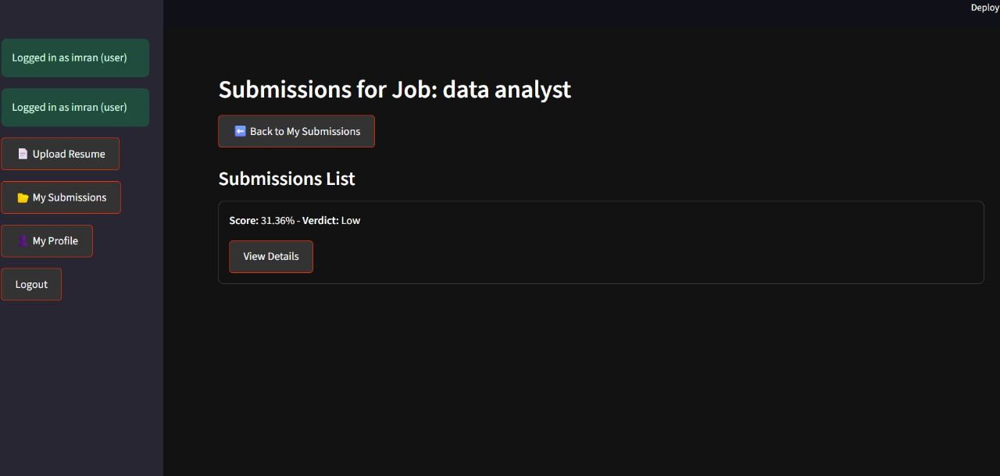  
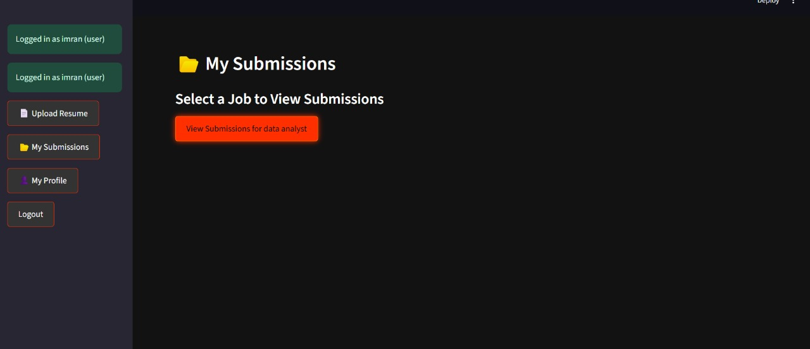  
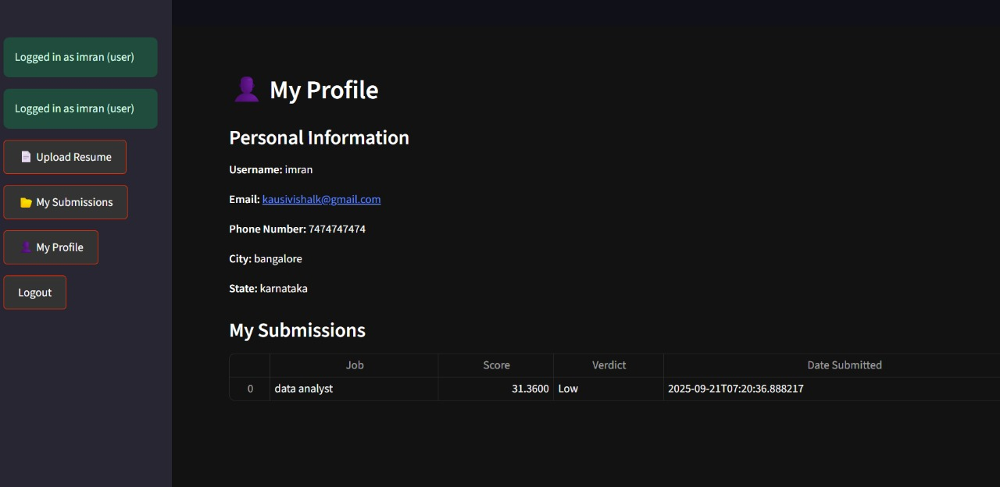  
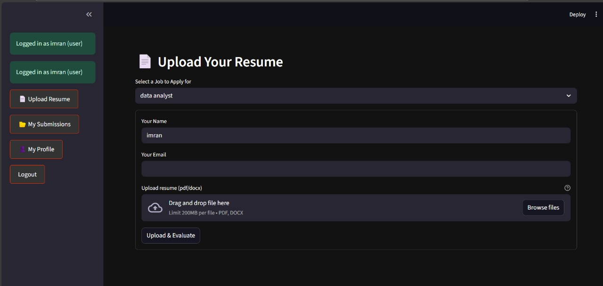  


<div align="center">

💡 *We’re building the future of hiring — faster, fairer, smarter.*  
⭐ If you like this project, don’t forget to **star the repo**!  


</div>
